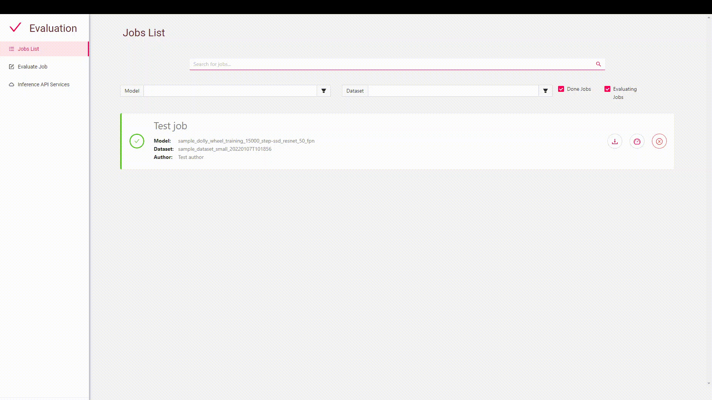

# BMW AI Evaluation GUI

This repository allows you to evaluate a trained computer vision model and get general information and evaluation
metrics with little configuration. You have to provide a labeled dataset that will be used as ground truths to assess
the model based on the provided dataset. Moreover, you need to provide an inference API that will be used to infer on
selected dataset.

You can use one of the inference API provided on [BMW-InnovationLab](https://github.com/BMW-InnovationLab).

You can use our [BMW-Labeltool-lite](https://github.com/BMW-InnovationLab/BMW-Labeltool-Lite.git) to label your dataset.
The images and labels can be used directly for evaluation.

- The evaluation GUI support both **Object detection** and **Image classification**.

- The app was tested with **Google Chrome** and it is recommended to use Chrome when training.


## Prerequisites

- Ubuntu 18.04 or higher
- Docker CE latest stable release
- Docker-Compose

<br>
<br> 

#### How to check for prerequisites

**To check if you have docker-ce installed:**

​                      `docker --version`

​    

**To check if you have docker-compose installed:**

​                     `docker-compose --version`


<br>
<br>

#### Installing Prerequisites

- If you neither have docker nor docker-compose use the following command

  ​            `chmod +x install_full.sh && source install_full.sh`

- If you have docker ce installed and wish only to install docker-compose and perform necessary operations, use the
  following command

  ​            `chmod +x install_compose.sh && source install_compose.sh`

<br>
<br>

#### Changes to make 

- Go to  `gui/src/environments/environment.ts ` and `gui/src/environments/environment.prod.ts  ` and change the following:

  - field `url`:  must match the IP address of your machine (**Use the `ifconfig `command to check your IP address . Please use your private IP which starts by either 10. or 172.16.  or 192.168.**)

- Go to  `gui/src/environments/environment.ts ` and `gui/src/environments/environment.prod.ts  ` and change the
  following:

    -   \- field `url`:  must match the IP address of your machine (***\*Use the `ifconfig `command to check your IP address . Please use your private IP which starts by either 10. or 172.16.  or 192.168.\****)


_environment.ts_


_environment.prod.ts_

If you are behind a proxy:

- Enter you proxy settings in the `<base-dir>/proxy.json ` file


- Enter the following command:

  ```sh
    python3 set_proxy_args.py
  ```

<br>
<br>

## Dataset Folder Structure

The following is an example of how a dataset should be structured. Please put all your datasets in the **datasets**
folder, under their corresponding type.

Alternatively, you can zip your dataset and upload it to the Evaluation GUI.

In both cases your dataset structure should be respective to the following folder structures:
<br>

#### Object detection case:

```sh
├──datasets/
    ├──object_detection/
        ├──sample_dataset/
            ├── images
                └── img_1.jpg
                └── img_2.png
            ├── labels
                 ├── json
                     └── img_1.jpg
                     └── img_2.png
        
```

- If you want to label your images, you can use
  our [BMW-LabelTool-Lite](https://github.com/BMW-InnovationLab/BMW-Labeltool-Lite) which is a free, open-source image
  annotation tool. This tool supports our JSON label format
  <br>

#### Image classification case:

```sh
├──datasets/
    ├──image_classification/
        ├── classification_dataset
            ├── cat
               └── img_1.jpg
               └── img_2.png
            ├── dog
               └── img_1.jpg
               └── img_2.png
```

 each class_name folder is named based on the class name and contains the images of this class
<br>
<br>

## Build the Solution

To build the solution, run the following command from the repository's root directory

```sh
docker-compose -f build.yml build
```

<br>
<br> 

## Run the Solution

To run the solution, run the following command from the repository's root directory

```sh
docker-compose -f run.yml up
```

After running the evaluation GUI you should have an instance of one of the desired inference API (the build and run of
these APIs are provided in the `Readme.md` in those repositories)

After a successful run you should see something like the following:


<br>
<br>

## Usage

- If the app is deployed on your machine:  open your web browser and type the following: `localhost:4200`
  or `127.0.0.1:4200`


- If the app is deployed on a different machine: open your web browser and type the following: `<machine_ip>:4200`

Open your web browser and go to [localhost:4200](http://localhost:4200/jobs-page)


<br>
<br>

#### 1-Add an inference service

To start any job we need to have an inference service added.

When adding an inference API url please make sure to avoid using`http://localhost:<port>`or `http://127.0.0.1:<port>`


<br>

#### 2-Start a job

To start a job we have to provide the dataset folder, or you can upload the dataset as a zip file.

After that you have to choose the inference service you want to use, and then you have to choose the appropriate
evaluation metric like **IoU grouping** in case of **object detection** job type.
**IoU grouping** parameter is used to discard linkage of wrong label between ground truth and prediction having IoU less
than **IoU Grouping**


<br>

### 3-Browse results

Batch results can be viewed during training, and after it's done. Detailed results are available to download once a job
finishes as well.


<br>

### 4-Output Results

You can obtain the output results via:

- Download zip file containing the results

  

- in the `output` folder located in `Evaluation GUI/output/<evaluation-job-name >`

  

The output results obtained after the job is completed contain **general** and **per label**  and **error images**


- **General Evaluation:** this folder contains some graphs and excel file containing metrics

  

- **Per Label Evaluation:**
    - **Object detection:** this folder contains folder named after class names and for each class name we find 2
      sub-folder named bounding-box and plots.
    - **Bounding box :** folder containing images plotted on them their ground truths and prediction respectively
    - **Plots:** contains 2 plots **histogram** and **scatter** if there is detection with IoU under bad IoU threshold
    - **Image classification:** this folder contains folder named after the class name provided and within each folder
      we find images corresponding to this class. A **Wrong_classified_images** folder contains wrongly classified
      images
- **Error Images:** contains corrupted images

For detailed Information about the evaluation metric and graphs provided by the **Evaluation GUI**

please refer to the  <a href="Evaluation GUI Guide.pdf">document </a> attached with the repository.

For better understanding of the evaluation metrics please refer to the <a href="Evaluation Metrics Guide.pdf">evaluation
metrics document </a>
<br>

### 5-Remove/Stop a job



<br>

## Citing

If you use this repository in your research, consider citing it using the following Bibtex entry:

```
@misc{sordievaluationtool,
  author = {BMW TechOffice MUNICH},
  title = {AI Evaluation GUI},
  how publishedd = {\url{https://github.com/BMW-InnovationLab/SORDI-AI-Evaluation-GUI}},
  year = {2022},
}
```

## Acknowledgments

- Joe Sleiman, [inmind.ai](https://inmind.ai/), Beirut, Lebanon
- Hadi Koubeissy, [inmind.ai](https://inmind.ai/), Beirut, Lebanon
- Afrah Hassan, [inmind.ai](https://inmind.ai/), Beirut, Lebanon
- Christy Antoun, [inmind.ai](https://inmind.ai/), Beirut, Lebanon
- Charbel Bou Maroun, [inmind.ai](https://inmind.ai/), Beirut, Lebanon
- Ismail Shehab, [inmind.ai](https://inmind.ai/), Beirut, Lebanon
- [Chafic Abou Akar](https://www.github.com/chaficii), BMW TechOffice, Munich, Germany
- Lorenzo Azar, BMW Innovation Lab, Munich, Germany
- Jimmy Tekli, BMW Innovation Lab, Munich, Germany

